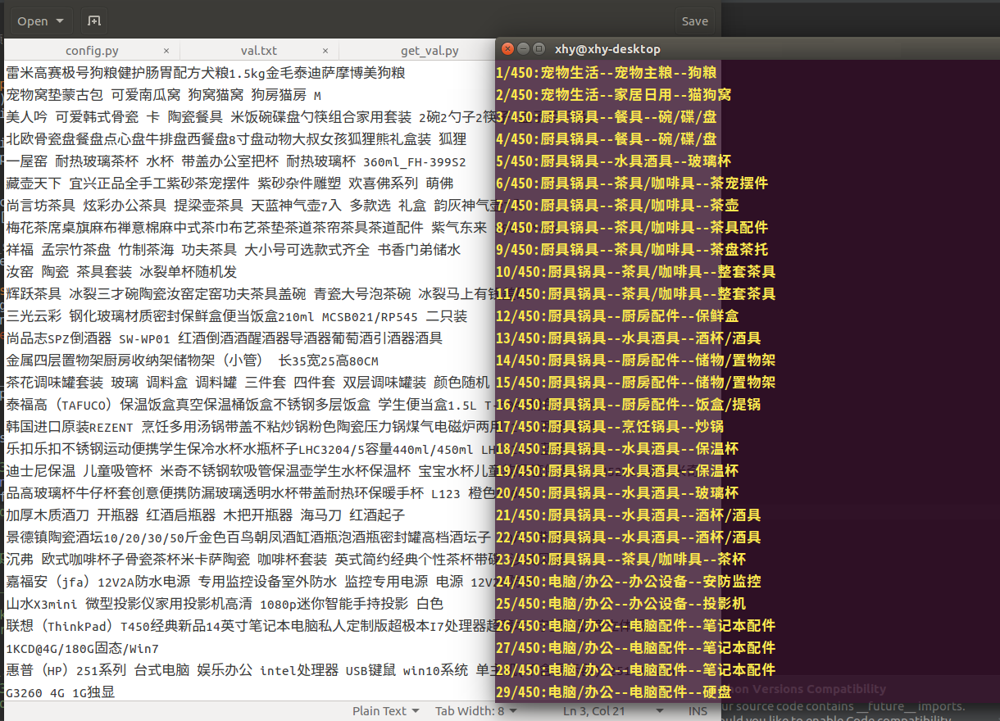
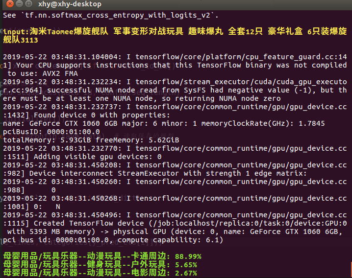

# text-classification-cnn  
基于CNN和Tensorflow的文本分类

## 结果预览  
**从文件读取**  


**从键盘输入**  



### Requirments

  -  硬件: GTX 960 GPU. 8GB以上内存.
  -  软件: Ubuntu 16.04, CUDA 9.1, Python 3.5.
    
  - Python package  
     -   ```pip install tensorflow```  
     -   ```pip install numpy```  
     -   ```pip install sklearn``` 
     
     
### Dataset
　　[训练和测试数据集](http://www.xyu.ink/wp-content/uploads/2019/05/text-classification-cnn.zip) 

　　将数据集下载好以后，解压并放到如下目录。

```yaml
.     
└── text-classificitaion-cnn  # 项目根目录
    ├── data                  # 存放字典、分类的类别、训练和测试数据
    │   ├── vocab.txt         # 词汇表
    │   ├── categories.txt    # 分类的种类(每行一个)
    │   ├── train.txt         # 训练集
    │   ├── val.txt           # 验证集(训练时验证准确率)
    │   └── test_small.txt    # 一个很小的测试集
    └── checkpoint            # 存放训练好的模型
```
　　data目录下的文件内容如下表：

|文件|行数|内容|  
|---|---|---|  
|vocab.txt|5000|符号和汉字的集合|  
|categories.txt|1258|分类的种类数目|  
|train.txt|450000|训练集合，文本和标签使用\t隔开|  
|val.txt|50000|验证集|
|test_small.txt|500|测试集(没有标签)|
      
     
### Training
1. 修改config.py  
num_classes与categories.txt的行数一样  
seq_length为文本的最大输入长度，一般比训练集最长的输入文本长度稍微大一些。  
如果训练时**内存不足**，可将hidden_dim调为128或者64。  
如果训练**时间过长**，可以将max_epochs调为3。

2. 运行   
```bash
python train.py
```

### Testing  
　　首先，确保自己的模型已经训练好了(在checkpoint目录下)，或者下载我们已经预训练好的模型并放到```checkpoint```目录下：    

**预训练的模型**  

|模型|链接|  
|---|---|   
|商品分类|[Download](http://www.xyu.ink/wp-content/uploads/2019/05/text-classification-cnn.zip)|   

#### 测试 
　　从键盘读入输入文本：  

```bash
python test.py -i
```

　　使用文件作为输入文本(每行作为一个输入)：  

```bash
python test.py -p data/test_small.txt
```

### Tensorboard   
　　使用tensoroard查看可视化结果：  
```bash
tensorboard --logdir=tensorboard/textcnn 
```

　　在测试集准确率约79%左右(总共1258个分类类别)。　　
